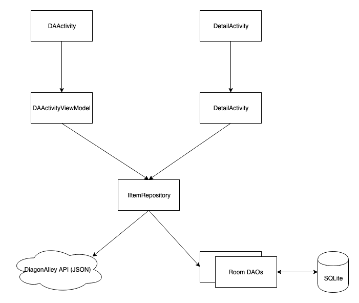

## Diagon Alley

Are you too busy to visit Diagon Alley to purchase or rent schooling supplies for Hogwarts? This is the app 
for you. 
Diagon Alley lets you rent and purchase books, wands, cauldrons and brooms.

### Architecture

The app is built on Kotlin and follows a MVVM architecture. The android activities function as views, the 
viewmodel serves the business logic and holds properties in the form of **LiveData** which the activity
observes.

The viewmodel works with the **repository** which abstracts out the data source from the viewmodel. The 
two data sources that we have in the app are the Diagon Alley API (faked using a JSON file) and a 
SQLite database.

Viewmodels in the app extend the **android architecture components** ViewModel classes. 
The caching to provide offline functionality wa achieved using a SQLite database which was built using
the **Room persistence library** from Google.

**Dependency Injection** was achieved using Koin.

Data is being served as a JSON file that I built using data from various harry potter fan sites.
Thanks to https://harrypotter.fandom.com/wiki/Main_Page for all the data and pictures.

### Testing efforts
- The viewmodel and the repository have been unit tested.
- Instrumentation testing was used to test the views (activities).The UI tests run best on an emulator. 
Due to a dependency on one of the UI testing library, the tests need to be run on a stock android
emulator with **no** Google Play services or Google APIs

### Other Libraries used on the project
* Android architecture components (ViewModel, LiveData and Room)
* RxJava and RxAndroid ( Reactive programming and multi threading)
* Koin (Dependency Injection)
* Glide (Image loading, rendering and caching)
* Timber (Logging)
* GSON (JSON parsing)
* Test Butler
* Mockito (Unit testing)
* Espresso (Automation/UI testing)

P.S: Screenshots can be found in the screenshots folder.
